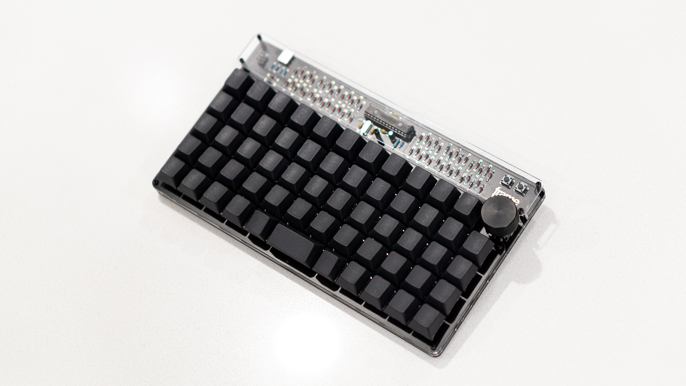
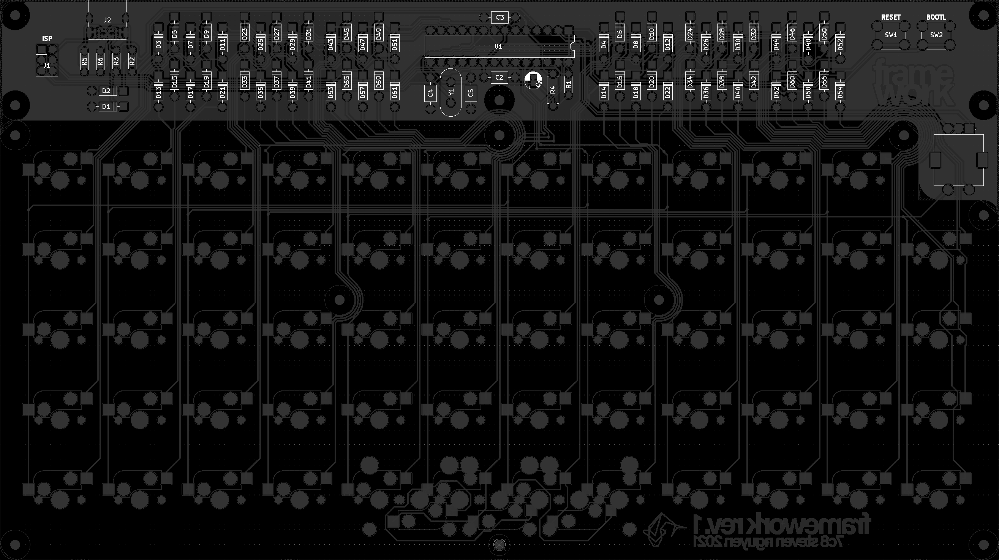

# 7c8 Framework


Framework is a 5x12 ortholinear keyboard featuring:

* All through-hole components (except Kailh hotswap sockets)
* QMK firmware with VIA support
* Rotary encoder
* Hotswappable switches
* FR-4 and acrylic sandwich construction
* USB Type-C
* MIT (one 2u), grid (two 1u), and two 2u, bottom row configuration

## Info

### License

Framework is licensed under [CC BY-NC-SA 4.0](https://creativecommons.org/licenses/by-nc-sa/4.0/). Please modify my design to make a keyboard that fits you!

### Revisions

**rev0** is an early prototype/proof of concept  
**rev1** is the current revision and should be used for fabrication or modification

### General

The ATmega328P does not come with a USB bootloader from factory. You will need to flash the chip with a bootloader through the ISP header first. You can find a pre-compiled .hex to flash at [USBaspLoader/bootloader.hex](USBaspLoader/bootloader.hex), or compile your own using the documentation found in the [USBaspLoader/](USBaspLoader/) folder. Everything has been preconfigured for use with the Framework.

[USBaspLoader](https://github.com/baerwolf/USBaspLoader) is a project maintained by [Stephan Baerwolf](https://github.com/baerwolf).

Fuse bytes should be:
* lfuse = 0xd7
* hfuse = 0xd0
* efuse = 0xfc

After [setting up your QMK environment](https://beta.docs.qmk.fm/tutorial/newbs_getting_started), flash the Framework firmware:

```
make 7c8/framework:default:flash # default keymap
make 7c8/framework:via:flash     # via-compatible keymap
```

### Layout

Framework supports MIT, grid, and 2x2u spacebar layouts. Refer to [framework.h](qmk/7c8/framework/framework.h). Layout options are also configurable in VIA.


### Construction

The top plate, main plate, and bottom plate, are already panelized for fabrication and should be 1.6 mm thick PCBs. The stack up is as follows:

* **Acrylic shield** - 1.5 mm [framework-acrylic-shield.dxf](rev1/acrylic/dxf/framework-acrylic-shield.dxf) (for component section)
* **Threaded spacers** - 10 mm (for component section)
* **Top plate** - 1.6 mm
* **Silicone** - 0.5 mm - [framework-acrylic-grid.dxf](rev1/acrylic/dxf/framework-acrylic-grid.dxf)
* **Acrylic** - 3.0 mm - [framework-acrylic-grid.dxf](rev1/acrylic/dxf/framework-acrylic-grid.dxf)
* **Main PCB** - 1.6 mm
* **Acrylic** - 3.0 mm - [framework-acrylic-base.dxf](rev1/acrylic/dxf/framework-acrylic-base.dxf)
* **Bottom plate** - 1.6 mm

All fastener hardware and spacers are M2.

The total nominal thickness of all of these layers is 11.3 mm, but can vary slightly in the real world. Using 1.6 mm thick PCBs, the only critical dimension to maintain is the 3.5 mm total distance between the top plate and main PCB for switch mounting reasons.

## Bill of materials (electrical)



Mfgr.                                   | Mfgr. part #         | Digi-Key part #        | Designator | Qty
----------------------------------------|----------------------|------------------------|------------|----
On Shore Technology Inc.                | ED281DT              | ED3050-5-ND            | U1         | 1
Vishay Beyschlag/Draloric/BC Components | A104K15X7RF5TAA      | 1109PHCT-ND            | C2, C3     | 2
AVX Corporation                         | SA102A220JAA         | 478-2426-1-ND          | C4, C5     | 2
ON Semiconductor                        | BZX79C3V6            | BZX79C3V6-ND           | D1, D2     | 2
ON Semiconductor                        | 1N4148               | 1N4148FS-ND            | D3 - D62   | 60
GCT                                     | USB4085-GF-A         | 2073-USB4085-GF-ACT-ND | J2         | 1
Stackpole Electronics Inc               | RNMF14FTC10K0        | S10KCACT-ND            | R1         | 1
Stackpole Electronics Inc               | RNMF14FTC75R0        | S75CACT-ND             | R2, R3     | 2
Stackpole Electronics Inc               | RNF14FTD1K50         | RNF14FTD1K50CT-ND      | R4         | 1
Stackpole Electronics Inc               | RNMF14FAD5K10        | RNMF14FAD5K10CT-ND     | R5, R6     | 2
TE Connectivity ALCOSWITCH Switches     | 1825910-6            | 450-1650-ND            | SW1, SW2   | 2
Fox Electronics                         | FC4STCBMF16.0-BAG200 | 631-1108-ND            | Y1         | 1
Panasonic Electronic Components         | ECE-A1HKA4R7         | P827-ND                | C1         | 1
Microchip Technology                    | ATMEGA328P-PU        | ATMEGA328P-PU-ND       | U1         | 1
Harwin Inc.                             | M20-9980345          | 952-2120-ND            | J1         | 1
Bourns Inc.                             | PEC11R-4220F-S0024   | PEC11R-4220F-S0024-ND  | [*1]       | 1
Kaihua Electronics Co., Ltd.            | CPG151101S11         | [*2]                   | [*1]       | 62

[*1] There is no reference designator for this component the board, but it should be obvious which footprint it belongs to.

[*2] Digi-Key does not stock this, but it seems easy enough to find through many vendors online if you search for the part number or "kailh hotswap sockets".
